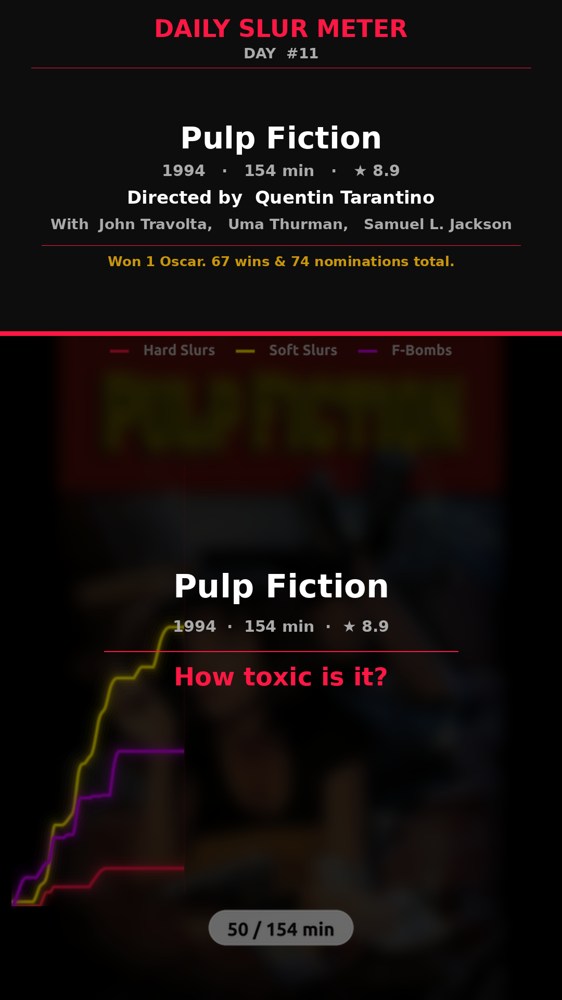
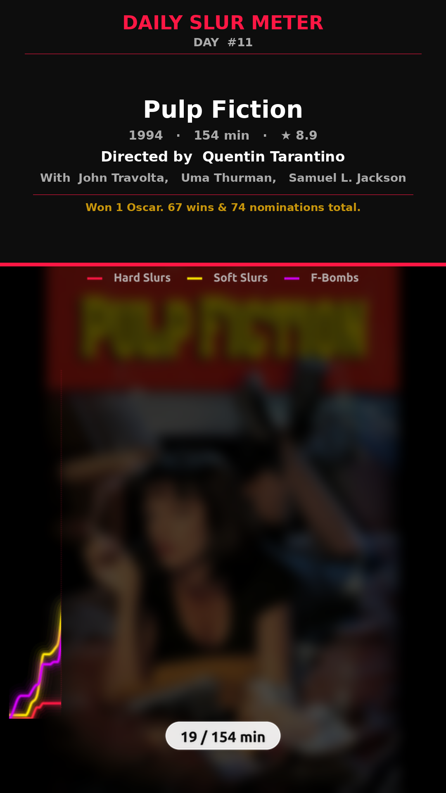
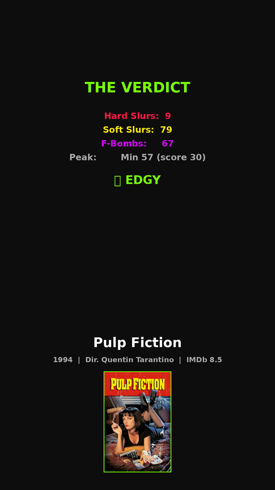

# 📉 Daily Slur Meter

[](https://github.com/Mapharazzo/slur-meter/actions/workflows/ci.yml)

Automated pipeline that fetches movie subtitles, performs profanity/sentiment analysis over runtime, and generates 9:16 vertical "Shorts" videos with animated rage charts.

## 🎬 Demo (Pulp Fiction, 1994)

We've included a sample rendering of Pulp Fiction in the repository:

| Intro | Rage Chart | Verdict |
| :---: | :---: | :---: |
|  |  |  |

## 🚀 Setup

The project uses [uv](https://astral.sh/uv) for lightning-fast Python dependency management.

```bash
# Clone the repo
git clone https://github.com/Mapharazzo/slur-meter.git
cd slur-meter

# Install dependencies (requires Python 3.11+)
uv venv && uv pip install -e ".[test]"
```

## ⚙️ Configuration

Edit `config.yaml`:
- Set your OpenSubtitles API key (`username` + `password` or API key)
- Customize the slur dictionary in the `categories` section
- Adjust video colors, fonts, and timing

## 🔌 Usage

```bash
# Fetch subtitles + analyze a movie
uv run main.py --imdb tt0110912

# Full pipeline: fetch + analyze + render video
uv run main.py --imdb tt0110912 --render

# Render from local analysis fixture
uv run main.py --render-only fixtures/pulp_fiction/analysis.json
```

## 🐳 Docker

Run the entire pipeline in a containerized environment (includes FFmpeg and fonts):

```bash
# Build & run with docker-compose
docker-compose up --build
```

## 🧪 Testing

```bash
# Run unit tests
make test-fast

# Run full CI suite (lint + coverage)
make test-ci
```

## 🏗️ Structure

```
├── config.yaml           # Master config (slur dict, colors, fonts)
├── main.py               # CLI orchestrator
├── pyproject.toml        # Unified Python project definition
├── Dockerfile            # Optimized container build (using uv)
├── Makefile              # CI/CD & developer shortcuts
├── .env                  # API keys
├── .env.example          # Template
├── .gitignore            # Clean git history settings
├── src/
│   ├── data/             # OpenSubtitles API + download
│   ├── analysis/         # SRT parsing + profanity engine
│   ├── video/            # Plotting + MoviePy compositing
│   └── publishing/       # Social upload handlers
├── fixtures/             # Representative demo assets (Pulp Fiction)
├── scripts/              # Dev tools (dev_frames.py)
├── results/              # (Gitignored) output JSON artifacts
└── output/               # (Gitignored) rendered video files
```
